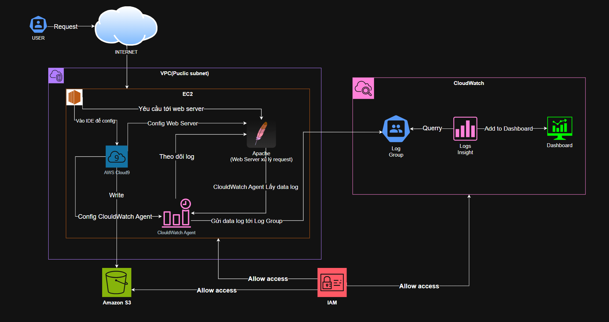

# Cloud Computing



## Phase 1: Lập kế hoạch kiến trúc và ước tính chi phí

Pha đầu tiên là bước quan trọng để xác định kiến trúc tổng thể của giải pháp và ước tính chi phí triển khai trên AWS. Bạn sẽ thiết kế sơ đồ kiến trúc, xác định các dịch vụ cần dùng, và tính toán chi phí dựa trên thời gian sử dụng trong 12 tháng tại vùng `us-east-1`.

---

### 🧩 Task 1: Thiết kế sơ đồ kiến trúc hệ thống

Bạn cần vẽ sơ đồ kiến trúc minh họa toàn bộ giải pháp, đáp ứng các yêu cầu từ phía chủ quán café.

#### Các thành phần bắt buộc trong sơ đồ:

- **Amazon CloudWatch log group**  
  Thu thập log từ máy chủ web (Apache).
- **CloudWatch Logs Insights**  
  Truy vấn và phân tích dữ liệu log dạng clickstream.
- **CloudWatch Dashboard**  
  Trực quan hóa dữ liệu log dưới dạng biểu đồ.
- **AWS Cloud9** (EC2 instance)  
  Chạy web server và môi trường phát triển/giám sát.
- **IAM Role**  
  Cấp quyền truy cập các dịch vụ AWS từ EC2 instance.

- **Amazon S3**  
  Lưu trữ bản sao log để truy vấn bằng SQL hoặc sử dụng công cụ phân tích dữ liệu khác.

#### Tùy chọn bổ sung:

- **Amazon Athena hoặc Amazon Redshift** _(nếu muốn truy vấn log lưu trong S3)_
- **Amazon VPC**: kiến trúc mạng gồm Public Subnet và Internet Gateway

#### Công cụ đề xuất để vẽ sơ đồ:

- [AWS Architecture Icons](https://aws.amazon.com/architecture/icons/)
- [AWS Reference Architecture Diagrams](https://aws.amazon.com/architecture/examples/)

> 🎯 Mục tiêu: Có một sơ đồ kiến trúc hoàn chỉnh, dễ hiểu và tuân theo chuẩn biểu tượng AWS.

---

### 💰 Task 2: Ước tính chi phí triển khai giải pháp

Sử dụng **[AWS Pricing Calculator](https://calculator.aws.amazon.com/)** để tính chi phí cho từng dịch vụ trong sơ đồ, giả định:

- **Region:** us-east-1
- **Thời gian sử dụng:** 12 tháng
- **Tần suất sử dụng:** dựa trên dữ liệu log giả lập trong lab

#### Một số thành phần cần đưa vào ước tính:

| Dịch vụ AWS           | Ghi chú                                    |
| --------------------- | ------------------------------------------ |
| Amazon EC2 (t2.micro) | Dùng chạy Cloud9 và web server             |
| Amazon S3             | Lưu log clickstream (~10 GB hoặc hơn)      |
| Amazon CloudWatch     | Chi phí theo dung lượng log và số truy vấn |
| IAM                   | Miễn phí                                   |
| AWS Data Transfer     | Dữ liệu outbound nếu có                    |

> 📝 Ghi lại toàn bộ thông số cấu hình và chi phí ước tính dưới dạng PDF hoặc chụp màn hình để đưa vào báo cáo/presentation.

---

### 🖼️ Tuỳ chọn: Thêm vào slide trình bày

Bạn có thể thêm:

- Sơ đồ kiến trúc
- Chi phí ước tính
- Ghi chú giải thích các lựa chọn thiết kế

Nếu có yêu cầu từ giảng viên, bạn có thể sử dụng template trình chiếu để tổng hợp kết quả từng phase của dự án.

---

### ✅ Kết quả đạt được

- Thiết kế sơ đồ kiến trúc hoàn chỉnh cho giải pháp phân tích clickstream.
- Ước tính chi phí triển khai trong 1 năm tại us-east-1.
- Có thể thuyết minh lý do lựa chọn dịch vụ và giải pháp thiết kế.

## Phase 2: Phân tích website và xác nhận dữ liệu weblog

Trong pha này, bạn sẽ:

- Phân tích hạ tầng đã được tạo sẵn trên AWS.
- Kiểm tra khả năng truy cập website quán café.
- Quan sát cách dữ liệu clickstream (log truy cập) được ghi lại.

---

### ✅ Task 1: Phân tích môi trường lab

Khi khởi động môi trường lab, các tài nguyên sau được tạo sẵn:

- **VPC (Virtual Private Cloud)** tên là `Lab VPC` với một public subnet.
- **AWS Cloud9** IDE chạy trên **EC2 instance** trong subnet đó.
- **Security Group** gắn với EC2 để kiểm soát truy cập.
- **IAM Role: `CafeRole`** cấp quyền cho EC2 truy cập các dịch vụ AWS (S3, CloudWatch...).
- EC2 instance đồng thời chạy:
  - Web server Apache (`httpd`) chạy ứng dụng quán café viết bằng PHP.
  - Cơ sở dữ liệu MariaDB.

> ⚠️ Lưu ý:
>
> - Khi lab kết thúc, EC2 instance sẽ bị **stop**.
> - Bạn cần **khởi động lại instance** nếu quay lại lab vào ngày khác.
> - Có thể **reset lab** để xóa sạch và khởi tạo lại từ đầu.

---

### 🌐 Task 2: Cho phép truy cập và kiểm tra website

Website chạy trên **port 80**, nhưng mặc định **Security Group không mở cổng** này. Ta cần:

1. Mở EC2 console, chọn instance.
2. Vào tab **Security → Security Groups** → chọn nhóm đang gắn với EC2.
3. Thêm rule mới:

   - Type: `HTTP`
   - Port: `80`
   - Source: `Anywhere - IPv4 (0.0.0.0/0)`

4. Copy **Public IPv4** của instance.
5. Mở trình duyệt và truy cập:
   ```http
   http://<public-ip>/cafe
   ```

### 📜 Task 3: Theo dõi và sao lưu log truy cập

#### Apache lưu log tại:

```bash
/var/log/httpd/access_log
```

#### Để quan sát log khi người dùng truy cập website:

1. Mở Cloud9 IDE terminal.
2. Chạy lệnh:

```bash
tail -f /var/log/httpd/access_log
```

#### Sao lưu log gốc:

```bash
sudo cp /var/log/httpd/access_log /home/ec2-user/environment/initial_access_log
```

## Phase 3: Cài đặt và cấu hình CloudWatch Agent để thu thập log Apache

Trong pha này, bạn sẽ cài đặt và cấu hình CloudWatch Agent trên máy chủ web để gửi các log truy cập (`access_log`) và lỗi (`error_log`) từ máy chủ Apache lên Amazon CloudWatch.

### 1. Cài đặt CloudWatch Agent

Thực hiện lệnh sau trên EC2:

```bash
sudo yum install -y amazon-cloudwatch-agent
```

Công cụ này giúp gửi log từ EC2 lên dịch vụ CloudWatch Logs.

---

### 2. Tải và cấu hình file `config.json`

Tải file cấu hình mẫu từ AWS S3 và di chuyển vào thư mục CloudWatch Agent:

```bash
wget https://aws-tc-largeobjects.s3.us-west-2.amazonaws.com/CUR-TF-200-ACCAP4-1-91575/capstone-4-clickstream/s3/config.json
sudo mv config.json /opt/aws/amazon-cloudwatch-agent/bin/
```

Xem nội dung:

```bash
sudo cat /opt/aws/amazon-cloudwatch-agent/bin/config.json
```

> File `config.json` định nghĩa:
>
> - Nguồn log (`access_log`, `error_log`).
> - Log group trong CloudWatch.
> - Thời gian giữ log.
> - Metrics cần thu thập.

---

### 3. Chuyển đổi định dạng log Apache sang JSON

CloudWatch Agent hoạt động hiệu quả hơn với log dạng JSON, vì vậy bạn cần chỉnh Apache để log theo định dạng này.

#### a. Chuẩn bị chỉnh sửa:

Tạo symlink để hiển thị file dễ hơn trên Cloud9:

```bash
ln -s /etc/httpd/conf /home/ec2-user/environment/httpdconf
```

Cấp quyền chỉnh sửa file:

```bash
sudo chown -R ec2-user /etc/httpd/conf
```

#### b. Chỉnh sửa file `httpd.conf`

Mở file `httpd.conf` và thực hiện:

**Sửa log lỗi (error log):**

Tìm dòng:

```apache
ErrorLog "logs/error_log"
```

Comment lại và thêm sau đó:

```apache
# ErrorLog "logs/error_log"
ErrorLog "/var/log/www/error/error_log"
ErrorLogFormat "{\"time\":\"%{%usec_frac}t\", \"function\" : \"[%-m:%l]\", \"process\" : \"[pid%P]\" ,\"message\" : \"%M\"}"
```

**Sửa log truy cập (access log):**

Tìm khối `<IfModule log_config_module>`, comment dòng `LogFormat ... combined`. Sau dòng `LogFormat ... common`, thêm:

```apache
LogFormat "{ \"time\":\"%{%Y-%m-%d}tT%{%T}t.%{msec_frac}tZ\", \"process\":\"%D\", \"filename\":\"%f\", \"remoteIP\":\"%a\", \"host\":\"%V\", \"request\":\"%U\", \"query\":\"%q\",\"method\":\"%m\", \"status\":\"%>s\", \"userAgent\":\"%{User-agent}i\",\"referer\":\"%{Referer}i\"}" cloudwatch
```

Tìm dòng:

```apache
CustomLog "logs/access_log" combined
```

Giữ nguyên, sau đó thêm dòng mới:

```apache
CustomLog "/var/log/www/access/access_log" cloudwatch
```

Nếu có khối `<IfModule logio_module>`, comment toàn bộ 3 dòng chưa được comment.

Lưu lại file `httpd.conf`.

---

### 4. Tạo thư mục log và khởi động lại dịch vụ

Tạo thư mục log:

```bash
sudo mkdir -p /var/log/www/access
sudo mkdir -p /var/log/www/error
```

Khởi động lại Apache:

```bash
sudo systemctl restart httpd
```

Khởi động CloudWatch Agent:

```bash
sudo /opt/aws/amazon-cloudwatch-agent/bin/amazon-cloudwatch-agent-ctl \
  -a fetch-config \
  -m ec2 \
  -c file:/opt/aws/amazon-cloudwatch-agent/bin/config.json \
  -s
```

Kiểm tra trạng thái Agent:

```bash
service amazon-cloudwatch-agent status
```

> Nếu hiển thị `active (running)` là bạn đã cài đặt thành công.

## Phase 4: Kiểm tra CloudWatch Agent và log clickstream

### 1. Kiểm tra file access_log

Truy cập ứng dụng web café và thực hiện một số hành động như xem menu, đặt hàng để tạo log.

Dùng lại lệnh như Phase 2 Task 3 để xem nội dung được ghi vào file log truy cập:

```bash
tail -f /var/log/www/access/access_log
```

> Lưu ý: log giờ đây sẽ được ghi dưới định dạng JSON.

---

### 2. Kiểm tra file `amazon-cloudwatch-agent.log`

Xác định vị trí file log của agent:

```bash
sudo cat /opt/aws/amazon-cloudwatch-agent/logs/amazon-cloudwatch-agent.log
```

Kiểm tra có các dòng như sau không:

```text
[inputs.logfile] Reading from offset 10620 in /var/log/www/error/error_log
[inputs.logfile] Reading from offset 19850 in /var/log/www/access/access_log
[logagent] piping log from apache/error/i-<instance-id> to cloudwatchlogs
[logagent] piping log from apache/access/i-<instance-id> to cloudwatchlogs
```

> Những dòng này xác nhận rằng agent đang đọc log và gửi lên CloudWatch. Bỏ qua các lỗi như `permission denied` trên `/sys/kernel/debug/tracing`.

---

### 3. Đặt hàng và kiểm tra log trên CloudWatch

- Truy cập website: `http://<public-ip>/cafe`
- Vào trang Menu, đặt một đơn hàng (sử dụng thiết bị di động nếu muốn thay đổi User-Agent).

Kiểm tra log:

- Mở AWS CloudWatch Console.
- Vào **Log Groups** → `apache/access`
- Mở log stream tương ứng.
- Mở rộng dòng log đầu tiên, xác minh hành động vừa thực hiện có được ghi nhận (dạng JSON).

> Clickstream data hiện đã được thu thập và lưu trên CloudWatch Logs thông qua CloudWatch Agent chạy trên web server.

## Phase 5: Sử dụng log giả lập và xác minh CloudWatch nhận đủ dữ liệu

Trong pha này, bạn sẽ thay thế file `access_log` hiện tại bằng một file log giả lập có sẵn. File này chứa nhiều dòng log truy cập hơn nhiều so với việc bạn tự tay truy cập website. Nhờ đó bạn có thể kiểm tra khả năng xử lý log ở quy mô lớn của CloudWatch Agent.

### 1. Phân tích file log giả lập

Xem vài dòng đầu của file log mẫu:

```bash
cat samplelogs/access_log.log | head
```

Xem dòng đầu dưới dạng JSON dễ đọc:

```bash
cat samplelogs/access_log.log | head -1 | python -m json.tool
```

Đếm số dòng log trong file:

```bash
cat samplelogs/access_log.log | wc -l
```

> Bạn sẽ thấy file này có rất nhiều log mô phỏng người dùng thực.

---

### 2. Thay thế file log thực bằng file log giả lập

Dừng CloudWatch Agent:

```bash
sudo systemctl stop amazon-cloudwatch-agent
```

Đặt file giả lập vào đúng vị trí CloudWatch Agent đọc log:

```bash
sudo cp samplelogs/access_log.log /var/log/www/access/access_log
```

> **Lưu ý:** Tên file phải là `access_log`, không phải `access_log.log`

Khởi động lại CloudWatch Agent:

```bash
sudo systemctl start amazon-cloudwatch-agent
```

---

### 3. Kiểm tra log giả lập trên CloudWatch

- Mở AWS CloudWatch Console
- Vào **Log Groups** → `apache/access`
- Mở log stream tương ứng
- Xác nhận:
  - Có **nhiều dòng log** xuất hiện
  - Có thể có **nhiều dòng cùng một timestamp** (do agent đọc nhanh file log lớn)

> Như vậy bạn đã xác minh thành công rằng log truy cập giả lập đã được gửi đầy đủ lên CloudWatch Logs.

# Phase 6: Phân tích dữ liệu clickstream với CloudWatch Logs Insights

Trong pha này, bạn sẽ sử dụng **CloudWatch Logs Insights** để truy vấn dữ liệu log truy cập (`access_log`) đã được gửi lên CloudWatch từ máy chủ Apache. Mục tiêu là xác định:

- Có bao nhiêu người truy cập vào trang menu
- Bao nhiêu người trong số đó đã đặt hàng
- Bao nhiêu người vào menu mà không mua gì

---

### 1. Truy vấn số người đã vào trang menu

Mở **CloudWatch Console** > **Logs Insights**

Chạy câu truy vấn sau để đếm số lượt truy cập vào `/cafe/menu.php`:

```sql
fields @timestamp, remoteIP
| filter request = "/cafe/menu.php"
| stats count(remoteIP) as Visitors by @timestamp
| sort @timestamp asc
```

- 📝 Ghi lại kết quả vào phase6-results.txt.
- Lưu truy vấn với tên: menu-visitors trong folder non-geo-results.

### 2. Truy vấn số người đã đặt hàng

**Tiếp tục với Logs Insights, chạy truy vấn sau:**

```sql
fields @timestamp, remoteIP
| filter request = "/cafe/processOrder.php"
| stats count(remoteIP) as Purchasers by @timestamp
| sort @timestamp asc
```

- 📝 Ghi lại kết quả vào phase6-results.txt.
- Lưu truy vấn với tên: purchasers trong folder non-geo-results.

## Phase 7: Điều chỉnh pipeline để cung cấp thông tin phân tích mới

Trong pha này, bạn sẽ nâng cấp hệ thống log hiện tại để cung cấp thêm thông tin **địa lý** và tạo **bảng điều khiển trực quan (dashboard)** cho chủ quán café. Ngoài ra, bạn cũng sẽ lưu trữ log vào Amazon S3 để có thể phân tích sau bằng SQL.

---

### 🎯 Mục tiêu chính

- Thêm thông tin vị trí địa lý (geolocation) vào dữ liệu clickstream.
- Tạo dashboard hiển thị:
  - Biểu đồ thành phố có nhiều người truy cập menu nhất.
  - Bảng thành phố có nhiều người đặt hàng nhất.
  - Biểu đồ vùng có nhiều người truy cập trang chính nhất.
  - Biểu đồ cột vùng có nhiều người đặt hàng nhất.
- Lưu trữ log vào Amazon S3 và có thể truy vấn bằng SQL.

---

### 🧪 Task 1: Hiểu yêu cầu mới từ chủ quán

Chủ quán café muốn biết:

- Khách truy cập đến từ thành phố/vùng nào nhiều nhất.
- Nơi nào có nhiều người đặt hàng nhất.
- Xem được thông tin này dưới dạng biểu đồ trực quan.
- Log cần được lưu trữ vào S3 để phân tích linh hoạt hơn trong tương lai.

---

### 📦 Task 2: Dùng file log có geolocation

#### Bước 1: Kiểm tra log mẫu

```bash
cd ~/environment
head -1 samplelogs/access_log_geo.log | python -m json.tool
cat samplelogs/access_log_geo.log | wc -l
```

##### Dữ liệu mẫu có chứa:

```json
"city": "La Rinconada",
"region": "Andalusia",
"country": "ES",
"lat": "37.48",
"lon": "-5.98"
```

#### Bước 2: Thay thế file log hiện tại

```bash
sudo systemctl stop amazon-cloudwatch-agent
sudo cp samplelogs/access_log_geo.log /var/log/www/access/access_log
sudo head -1 /var/log/www/access/access_log
```

#### Bước 3: Xóa log stream cũ

Vào AWS Console → CloudWatch Logs → Log group apache/access → chọn log stream cũ và Delete.

#### Bước 4: Khởi động lại agent

```bash
sudo systemctl start amazon-cloudwatch-agent
```

### 📊 Task 3: Tạo Dashboard

#### Widget 1: Pie Chart – Thành phố có nhiều người truy cập menu nhất

- Widget name: Cities visiting the menu the most
- Type: Pie
- Query:

```bash
fields remoteIP, city
| filter request = "/cafe/menu.php"
| stats count() as menupopular by city
| sort menupopular desc
| limit 10
```

#### Widget 2: Table – Thành phố đặt hàng nhiều nhất

- Widget name: Cities placing the most orders
- Type: Logs Table
- Query:

```bash
fields city
| filter request = "/cafe/processOrder.php"
| stats count() as orders by city
| sort orders desc
| limit 10
```

#### Widget 3: Pie Chart – Vùng truy cập trang chính nhiều nhất

- Widget name: Regions visiting the website the most
- Type: Pie
- Query:

```bash
fields region
| filter request = "/cafe"
| stats count() as visits by region
| sort visits desc
| limit 10
```

#### Widget 4: Bar Chart – Vùng có nhiều đơn hàng nhất

- Widget name: Regions placing the most orders
- Type: Bar
- Query:

```bash
fields region
| filter request = "/cafe/processOrder.php"
| stats count() as purchases by region
| sort purchases desc
| limit 10
```

### ☁️ Task 4: Lưu log vào Amazon S3

#### Bước 1: Kiểm tra tên bucket

```bash
aws s3 ls
```

##### Ví dụ kết quả:

```bash
2025-06-13 15:40:15 accap4-logsbucket--af31f500
```

#### Bước 2: Lưu file log lên S3

```bash
aws s3 cp /var/log/www/access/access_log s3://accap4-logsbucket--af31f500/
```
